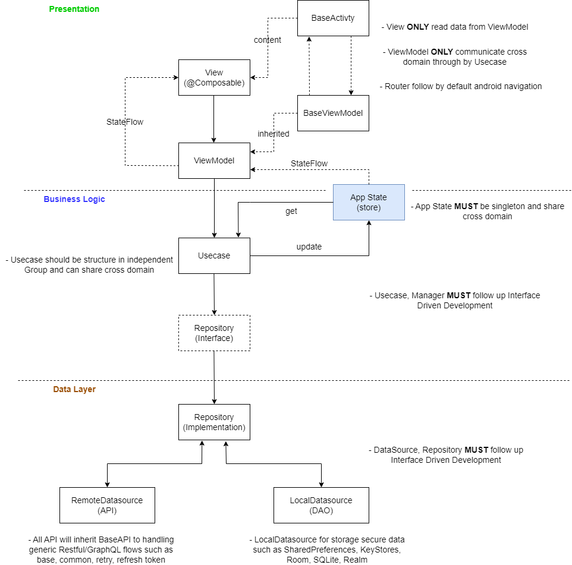

# TymeX
Online interview home testing

## Getting Started

This project is a Android app of Online interview powered by Kotlin.

## Architecture

Apply MVVM + Clean Architecture Pattern
```
|-----------------  Layers  ------------------|
| Presentations | Business Logic | Data Layer |
|:-------------------------------------------:|

|--------------------------  Actual  ---------------------------|
| Presentations  |      Business Logic    |         Data        |
|:-------------------------------------------------------------:|
| View <--> ViewModel <--> Usecase <--> Repository <--> API/Dao |
|:-------------------------------------------------------------:|
|:----  Extension Entity   ----|----    Basic Entity   --------:|
|:-------------------------------------------------------------:|
```


### View
- This is the major view layer of Android app and is categorized by module (feature or epic).
- View is built by Kotlin
- View is rendered based on the data from ViewModel
- View that are used across module will be placed in *common* and **MUST NOT** build based on ViewModel.

Examples of a standard view that build based on view model:
```kotlin
    @Composable
    fun ContactDetailScreen(
        viewModel: ContactDetailViewModel
    ) {
        val contact = viewModel.contact
        if (contact is Contact) {
            Column(
                modifier = Modifier
                    .fillMaxSize()
                    .padding(horizontal = 32.dp),
                horizontalAlignment = Alignment.CenterHorizontally
            ) {
                Text(text = contact.fullName())
                Spacer(modifier = Modifier.height(32.dp))
                Avatar(imageUrl = contact.avatar, sizeInDp = 92F)
                Spacer(modifier = Modifier.height(32.dp))
                PrimaryButton(
                    onClickListener = {

                    }
                )
                Spacer(modifier = Modifier.height(32.dp))
            }
        } else {
            Box(
                contentAlignment = Alignment.Center,
                modifier = Modifier.fillMaxSize() ){
                Text("Not found contact with id = ${viewModel.contactId()}")
            }
        }
    }
```

### ViewModel
- It aims to handle business logic for a specific view such as validation, retrieve data, ...
- ViewModel uses use-case to retrieve data or handle domain business logic
- ViewModel observes AppState data to get application state

and provide ViewModel into View in Activity:
```kotlin
    override fun viewModelBuilder(): ViewModelProvider.Factory {
        return viewModelFactory {
            ContactDetailViewModel(
                contactId = contactId,
                contactManager = AppState.instance.contactManager()
            )
        }
    }
```

### Usecase
- It's the main layer to handle all data business
- It's a stateless layer, so it will be constructed on demand
- A use-case usually handle one use-case of a specific epic
- A use-case can communicate with other use-cases
- All use-case **MUST** be defined with an interface (abstract class), use-case communicate with view-model through by the interface
- Constructor in Usecases class (DI class)

```kotlin
    class UseCase {
        companion object {
            fun loadContactListUsecase() : LoadListUsecase<Contact> {
                return LoadContactsUsecaseImpl(
                    contactManager = AppState.instance.contactManager(),
                    contactRepository = Repository.instance.contactRepository()
                )
            }
        }
    }
```

### AppState
- It's singleton that stores all application state
- Each kind of state-manager is accessed through by protocol

```kotlin
    class AppState {
        companion object {
            val instance = AppState()
        }

        private lateinit var contactManagerInstance: ContactManager

        fun contactManager(): ContactManager {
            if (::contactManagerInstance.isInitialized) {
                return contactManagerInstance
            }
            contactManagerInstance = ContactManagerImpl()
            return contactManagerInstance
        }
    }
```

### Repository
- It's imported from local library project name *Repository*
- The main data source of app that is used by service layer
- It's a stateless layer, so it will be constructed on demand
- It contains a little bit business rules to branch data source that should be used, from client or dao
- It also handle the caching logic rules, from memory or local storage
- All repositories **MUST** be defined with an interface (abstract class), service communicate with repository through by the interface
- Constructor in Repository class (DI class)

```kotlin
    class Repository {
        companion object {
            val instance = Repository()
        }

        // repository
        fun contactRepository(): ContactRepository {
            return ContactRepositoryImpl(
                contactApi = contactApi()
            )
        }

        // api
        fun contactApi(): ContactApi {
            return ContactApiImpl()
        }
    }
```

### API/Dao
- It's data source layer, client means data is from RestFul API and Dao means data is from local storage
- BaseAPI is advanced class to handle all generic calling API, retry when access token is expired and need to refresh, also for general API error handling
- BaseDao is advanced class to handle the generic storage, save/get list or item, or even for a string or an integer
- All APIs & Dao **MUST** be defined with an interface (abstract class), repository communicate with api/dao through by the interface

### Model
- It covers all entities in app
- Have 2 kind of models, basic entity and extension entity.
- Basic entity is belong to repository, it defines all entity's properties and support basic parsing with JSON
- Extension entity is belong to UI layer, it defines all utility methods of an entity

## Dependencies Injection
- There are 3 kinds of class to support construct instance for DI, AppState, Usecases and Repository
- AppState provide the instance of State-Manager
- Usecases is a singleton class that provide the instance of use-case.
- Repository is a singleton class that provide the instance of repository, api & dao

## Code Structure
Here is list all of key folders or files in code structure:
```
.
|-- root
|   |-- app
|   |   |-- usecase                         *all use case that need in project*
|   |   |-- Usecase.kt                      *Usecase class, singleton class that support DI for representation layer*
|   |   |-- app_state                       *all app state that need in project*
|   |   |-- theme                           *includes design Tokens to manage all Styles such as font, size, color, spacing
|   |   |-- ui                              *define all ui modules & theme*
|   |   |   |-- modules                     *define all UI Views & ViewModel that categorized by module*
|   |   |   |-- theme                       *define all theme styles*
|   |-- test                                *unit testing for app (usecase, view model, ui, utilities, helper functionalities ...)*
|-- repository
|   |-- main
|   |   |-- Api                         *define all api classes*
|   |   |-- Dao                         *define all dao classes*
|   |   |-- Enum                        *define all enum*
|   |   |-- Model                       *define all basic entities*
|   |   |-- Repository                  *define all repository classes*
|   |   |-- Repository.kt               *Repository class, singleton class that support DI for data layer*
|   |-- test                            *unit testing for repository (Repository, Dao, API, ...), require testing for repository only*
```

## Router
Navigate by default android navigation by Intent & Activity
```kotlin
    val intent = Intent(context, ContactDetailActivity::class.java)
    intent.putExtra("id", it.id)
    context.startActivity(intent)
```

## Testing
- All ViewModels **MUST** have unit testing for all Events and StreamSubscriptions, except static constructor.
- All Usecases **MUST** have unit testing for all public methods.
- All Repositories **MUST** have unit testing for all public methods.